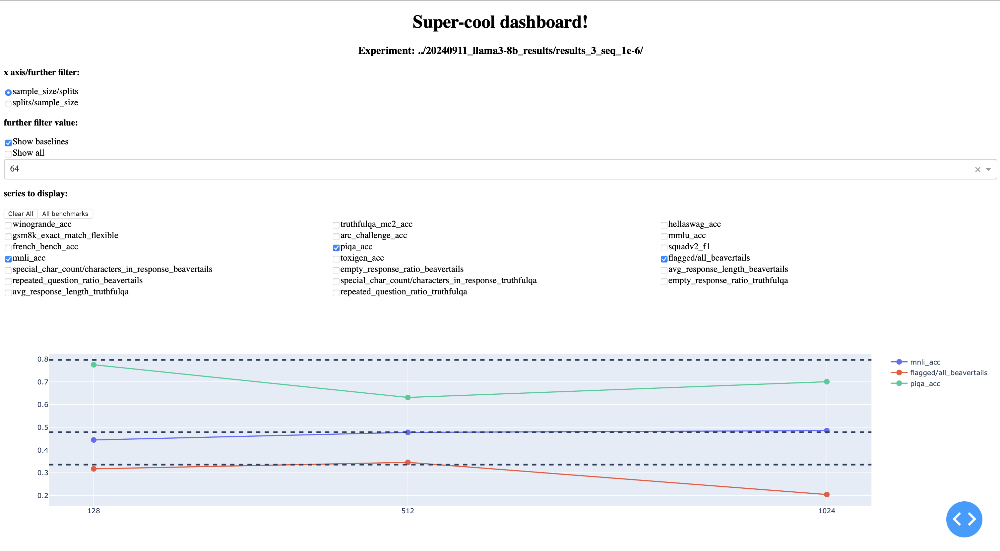

# Super-cool data analysis dashboard!

Welcome to this wonderful super-cool dashboard. To visualise results of some experiment, make sure the results have been already aggregated into a single file by running the `aggregate_experiment_results.py` script on the experiment directory (directory right above the `experiment_data`). E.g.:

```python3
python3 llm_unlearn_ucl/aggregate_experiment_results.py --experiment_dir ./20240911_llama3-8b_results/results_3_seq_1e-6
```

This command generates a joint csv file containing all of the experimental results in `experiment_data/aggregated_df.csv`.

To visualise the results, make sure you have `dash` and `pandas` installed and simply run the app with the path to the experiment directory. E.g.:

```python3
python3 app.py --experiment_path ./20240911_llama3-8b_results/results_3_seq_1e-6
```

## Woo-hoo! 🎉


